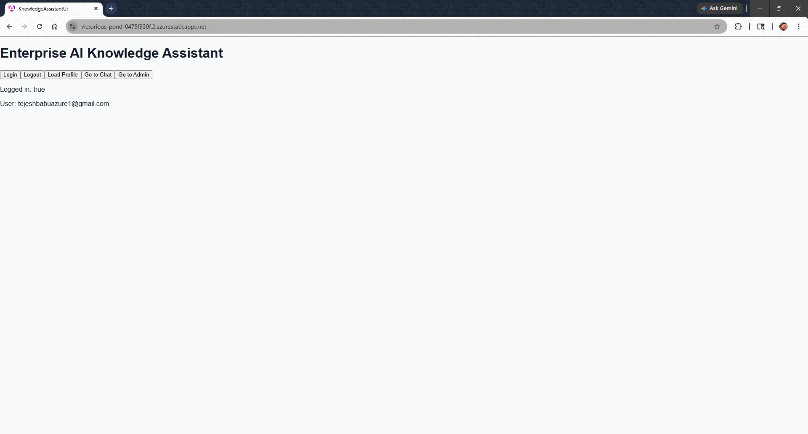
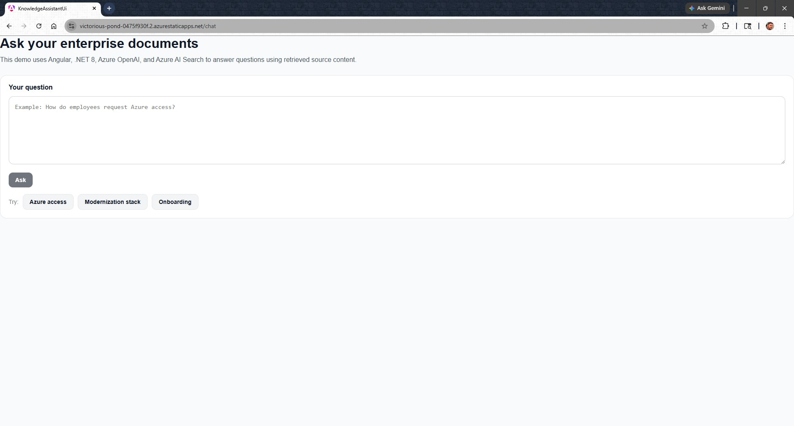
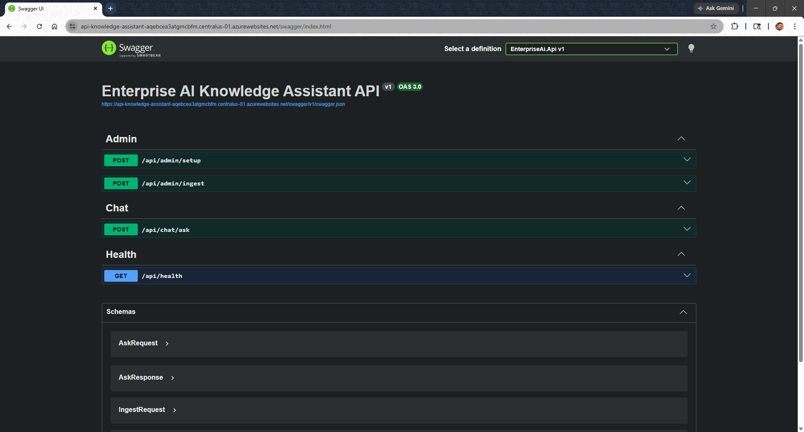
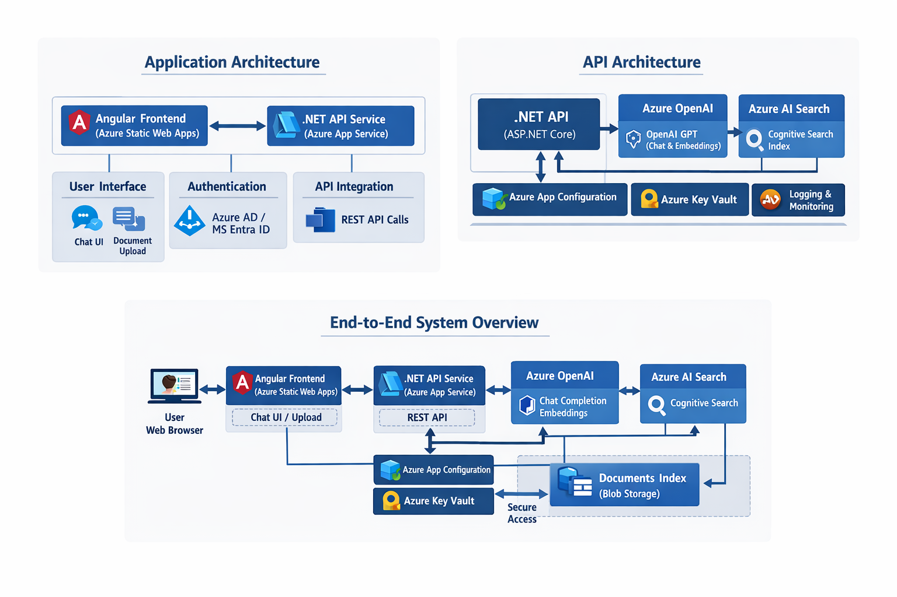

# Enterprise AI Knowledge Assistant

**Angular 21 + .NET 8 + Azure OpenAI + Azure AI Search + Azure AD SSO**

An enterprise-ready AI Knowledge Assistant that enables users to securely query organizational knowledge using **Azure OpenAI**, **Vector Search**, and **Azure AD SSO** — built with **Angular 21** frontend and **.NET 8 Web API** backend.

---

# 🚀 Live Demo

**Angular UI**
https://victorious-pond-0475f930f.2.azurestaticapps.net/

**API Swagger**
https://api-knowledge-assistant-aqebcea3atgmcbfm.centralus-01.azurewebsites.net/swagger/index.html

---

# 🧠 What This Project Demonstrates

* Angular 21 + .NET 8 full-stack architecture
* Azure OpenAI Chat Completion integration
* Azure AI Search vector retrieval (RAG)
* Azure AD (Entra ID) SSO authentication
* Role-based authorization using AD groups
* Azure App Configuration centralized settings
* Secure admin-only ingestion pipeline
* Production-ready cloud deployment

---

# 🏗️ Architecture

```
User
  │
  ▼
Angular 21 UI (Azure Static Web Apps)
  │
  │  Azure AD Login (MSAL)
  ▼
Azure AD / Entra ID
  │
  │ Access Token
  ▼
.NET 8 API (Azure App Service)
  │
  ├── Azure OpenAI (Chat)
  ├── Azure AI Search (Vector Search)
  ├── Azure App Configuration
  └── Azure Key Vault (optional)
  │
  ▼
Response to Angular UI
```

---

# 🔐 Authentication & Authorization

Implemented using **Azure AD (Microsoft Entra ID)**

### Authentication

* Angular MSAL login
* Authorization Code + PKCE
* JWT Bearer token validation in API

### Authorization

AD Groups:

| Group       | Access           |
| ----------- | ---------------- |
| a-app-user  | Read-only access |
| a-app-admin | Admin ingestion  |

Protected endpoints:

```
/api/profile/me
/api/chat
/api/admin/ingest (Admin only)
```

---

# ⚙️ Tech Stack

### Frontend

* Angular 21
* MSAL Angular
* TypeScript
* Standalone Components
* Router Guards

### Backend

* .NET 8 Web API
* Microsoft.Identity.Web
* Repository Pattern
* Dependency Injection

### Azure Services

* Azure OpenAI
* Azure AI Search
* Azure App Service
* Azure Static Web Apps
* Azure AD (Entra ID)
* Azure App Configuration

---

# 📸 Screenshots

## Login via Azure AD



## Chat Interface



## Secured API Swagger



## Architecture



---

# 🛠️ Run Locally

## 1. Clone repo

```
git clone https://github.com/<your-username>/enterprise-ai-knowledge-assistant.git
```

---

## 2. Run API

```
cd api
dotnet restore
dotnet run
```

API runs on:

```
https://localhost:7086
```

---

## 3. Run Angular UI

```
cd ui
npm install
npm start
```

Angular runs on:

```
http://localhost:4200
```

---

# 🔧 Environment Configuration

## Angular

`environment.ts`

```
azureAd:
  clientId: YOUR_CLIENT_ID
  tenantId: YOUR_TENANT_ID

api:
  baseUrl: https://localhost:7086/api
```

---

## .NET API

`appsettings.json`

```
AzureAd:
  TenantId: YOUR_TENANT_ID
  ClientId: YOUR_API_CLIENT_ID
```

---

# ☁️ Azure Deployment

## UI

Deploy to:

* Azure Static Web Apps

Build output:

```
dist/knowledge-assistant-ui/browser
```

Includes:

```
staticwebapp.config.json
```

---

## API

Deploy to:

* Azure App Service

Environment variables configured:

```
AzureAd__TenantId
AzureAd__ClientId
AppConfig__Endpoint
```

---

# 🔁 Authentication Flow

```
User opens Angular UI
        ↓
Redirect to Azure AD login
        ↓
User signs in
        ↓
Azure AD returns access token
        ↓
Angular calls API with Bearer token
        ↓
API validates token
        ↓
API calls Azure OpenAI + AI Search
        ↓
Response returned to UI
```

---

# 🔐 Security Features

* Azure AD SSO
* JWT token validation
* Role-based authorization
* Admin-only ingestion endpoint
* Secure config via App Configuration
* No secrets in source code

---

# 📦 Project Structure

```
enterprise-ai-knowledge-assistant
│
├── ui/                 Angular 21 app
├── api/                .NET 8 Web API
├── docs/
│   └── images/
│
├── README.md
└── LICENSE
```

---

# 🎯 Features

* Chat with enterprise documents
* Vector search retrieval
* Azure OpenAI responses
* Admin ingestion pipeline
* Secure SSO login
* Role-based UI access
* Cloud deployed

---

# 🚀 Future Enhancements

* Streaming chat responses
* Conversation history
* File upload UI
* Multi-tenant support
* Telemetry / usage analytics
* Role-based UI rendering

---

# 👨‍💻 Author

Built as part of hands-on exploration of:

* Angular 21
* .NET 8
* Azure OpenAI
* Azure AI Search
* Azure AD SSO
* Enterprise architecture patterns

---

# ⭐ If you found this useful

Star the repo and connect on LinkedIn.
